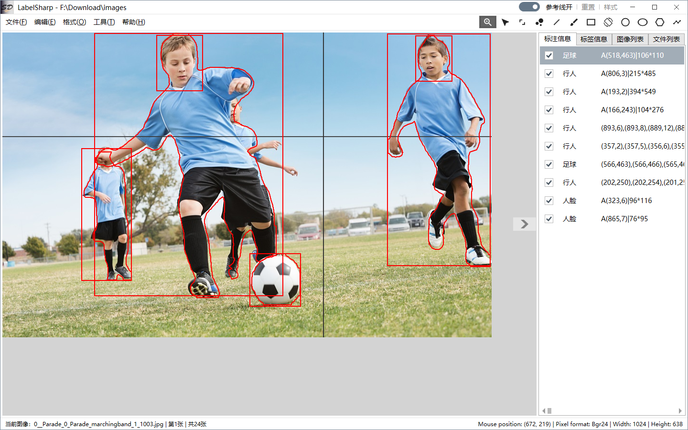

## 框架地址：https://gitee.com/lishilei0523/SD.Framework

#### 项目说明
> 专注于深度学习计算机视觉图像标注操作，兼容LabelMe格式，包含大多数常用标注功能；

> 自带YOLO v11目标检测与图像分割模型辅助标注；

#### 开发目的：
    1、市面常用标注软件如LabelImg、LabelMe使用不舒服；

    2、方便标注人员快速标注；

#### 主要涉及技术：
    UI部分：WPF、Canvas、MahApps.Metro、Caliburn.Micro、FluentWPF等；

    算法部分：OpenCV、OnnxRuntime等；

#### 主要功能模块：
    标注部分：
        点、线段、画刷、矩形、圆形、椭圆形、多边形、折线段标注；

    格式部分：
        导入/导出PascalVOC、YOLO目标检测、YOLO图像分割格式；        
        批量PascalVOC格式转换csv格式；
        批量PascalVOC格式转换YOLO目标检测格式；

    工具部分：
        切割图像：方便进行二次标注或图像分类；
        保存掩膜：方便推理过程提取ROI；

## 推荐

> 关联项目，OpenCV工作室：
> [PointCloud Studio](https://gitee.com/lishilei0523/PointCloud-Studio)

> 关联项目，点云工作室：
> [OpenCV Studio](https://gitee.com/lishilei0523/OpenCV-Studio)

## 首页预览

